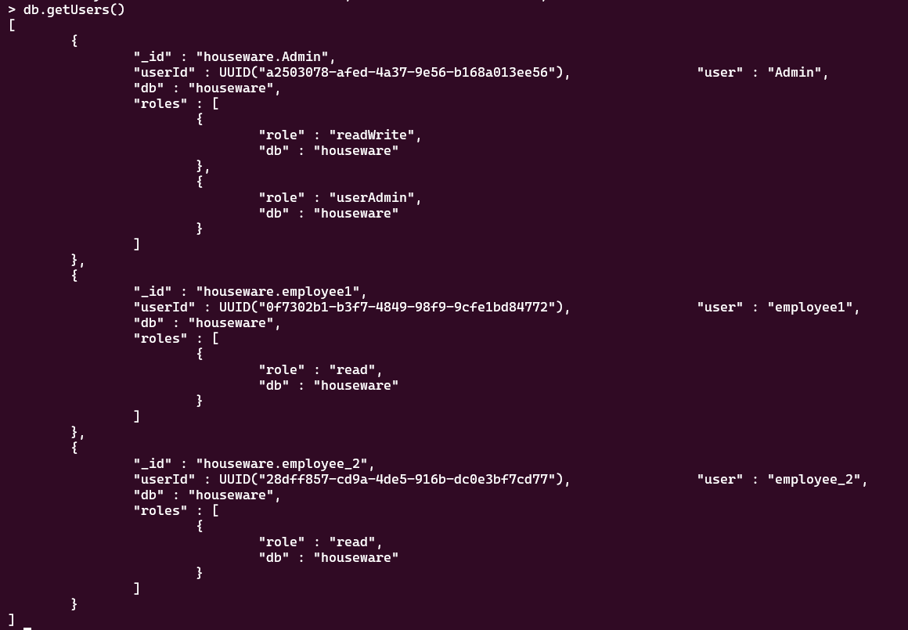

# `/docs`

 # File Structure 

**Models**: The user schema and claims schema is present in models.go inside the models folder.

**Main.go**: All the handlers and the main function are present in main.go file inside backend>cmd.

 

# Packages Used

The packages involved in the project are:

- context
- time
- log
- net/http
- github.com/gorilla/mux
- go.mongodb.org/mongo-driver/mongo
- go.mongodb.org/mongo-driver/mongo/options
- encoding/json
- go.mongodb.org/mongo-driver/bson
- golang.org/x/crypto/bcrypt
- github.com/dgrijalva/jwt-go
- fmt 
- go.mongodb.org/mongo-driver/bson/primitive
- github.com/dgrijalva/jwt-go

 

## Type structs
- There are two type structs:
  - `User`: This stores the username and password for the data.
  - `Claims`: This is for storing the claims for the jwt token.
  
# Setting up the Database

I have used MongoDB database for the integration for which I have used MongoDB Compass in my local system and also mongo on my terminal.

## Process
- In the main function i.e. in main.go file, the interation of database is written.
- I used the package mongo which provides a MongoDB Driver API for Go.
- Declared the vairable `client` like `var client *mongo.Client`.
- For controlling the timeout of requests, I used the context.WithTimeout declared with a variable `ctx`.
- I used MongoDB compass for this application and copied the connection string i.e. `mongodb://localhost:27017`
- Next for connecting the application to the MongoDB server, the client variable was used `Client().ApplyURI`
- The main func starts with a confirmation line of `Starting the application` which confirms that everything is working fine.

 

# Roles and Privileges
- I have made a `Admin` user which will have the rights of `readWrite` i.e., the Admin can  Add any user as well as Delete one.

 

- I also added couple of users also which will have only the `read` privileges.

 

 

 

# All the Handlers

## Hashing the password

- For hashing the password, `golang.org/x/crypto/bcrypt` is used.
- So that when we enter the data, the password should be saved in the hashed format.
- In this function , I basically took `bcrypt.GenerateFromPassword` to hash the password which I am getting from the user.

 

## Setting the Routes
- I used Gorilla Mux for setting all the routes.
- The variable `router` was defined as `router:= mux.NewRouter()` to call all the handler functions.
- I wanted the application to serve on localhost:8000, so `log.Fatal(http.ListenAndServe("localhost:8000", router))`.

 

## Enter data

- A function named `CreateUser` is used for this request with `http` `request` and `response` parametrs. 
- The mongo package by go, automatically creates the database and the collection if it is not present beforehand.
- The collection is defined as `collection := client.Database("houseware").Collection("users")`
- Database: houseware, Collection: users
- For setting the route for this function, I used `router.HandleFunc("/user/create_user",CreateUser).Methods("POST")`
- So the API became, `http://localhost:8000/user/create_user`
- For this API, I used the POST request.

.png)

 

## Login

- For the login functionality, a function named `UserLogin` is created.
- For login the username is matched as well as the password entered by the user and the hashed password is compared.
- At every point, checks are there like `if err !=nil` to check the errors and also printing them.
- When the login is successfull, a JWT token gets created.
- Expiration time for the token is set to be 60 mins.
- I have created the object of a claims and then will sign it.
- Now the token is created with the HS256 signing method.
- I have also set the cookie, which will be visible after the login request.
- `http://localhost:8000/user/login`
.png)
.png)

 

## Delete the data

- For deleting, I created the function `Delete_user`
- For this, I chose the param as username as the admin can delte a particular data by entering the username, making sure that the each username is unique.
- http://localhost:8000/user/{username}

.png)

 

## Authorization
- For the authorization, the JWT token will be checked and hence the user who has logged in will be authenticated.
- So firstly, I am getting the cookie and creating the token string for that cookie.
- Using the `jwt.ParseWithClaims` function, I I passed the claims, token string and another function which will return the claims.
- On success, a message,`Hello` with name of the logged person will be printed.
- `http://localhost:8000/user/authorize`

 

.png)

 

## List all the users

- For listing all the users, function `ShowAll` is made, which will show all the users in the database.

- `http://localhost:8000/user/all",ShowAll`

.png)

.png)

 

## Refresh Token

- For refreshing, the token will be refreshed within the last 30 seconds of the expiration time.
-  This will be achieved by `Sub(time.Now()) > 30*time.Second`
- After the running the following API, a token named ` refreshed_token will be generated.
- `http://localhost:8000/user/token_refresh`

.png)

 

## Logout

- The logout will simply delete the cookie.
- `http://localhost:8000/user/logout`
 

 .png)